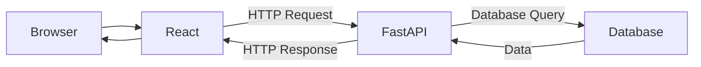

# Day 01 — Web Fundamentals
## 1. Web Application Architecture

## 2. What Happens When a User Submits a Form?

React collects the entered data and sends it to the backend through an HTTP API request. FastAPI receives the request, validates and processes the data, and communicates with the database to store it. The database returns the result of the operation to FastAPI. FastAPI then sends an HTTP response to React, which updates the user interface and can display a success message.

## 3. Frontend vs Backend vs API vs Database

| Term | Meaning |
|---|---|
| Frontend | The part of the application that the user sees and interacts with. |
| Backend | The server-side part that handles requests, application logic, and communication with the database. |
| API |A communication interface that allows different software components to exchange data through defined rules.|
| Database | A system used to store and retrieve application data. |